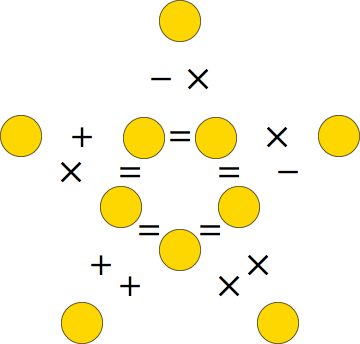
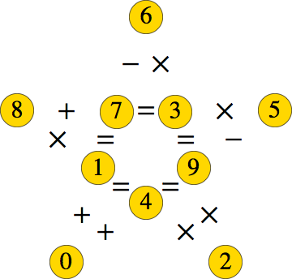
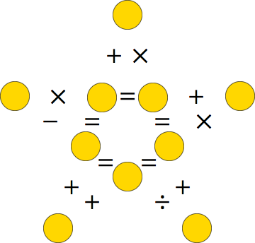
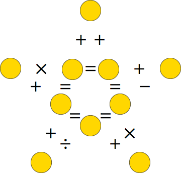
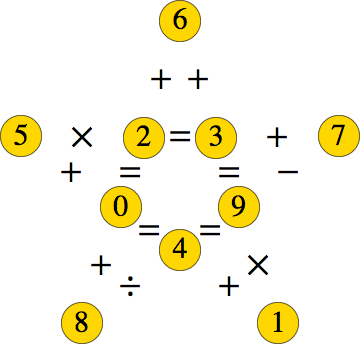

# feup-plog-proj-2

# Gold Star Puzzles

Insert the digits 0-9 into the circles to make the 5 equations true when read from left to right. Each digit is used exactly once. Each puzzle below has a unique solution.

| Problem                   | Solution                                  |
|---------------------------|-------------------------------------------|
|  |  |
|  |  |
|  |  |
